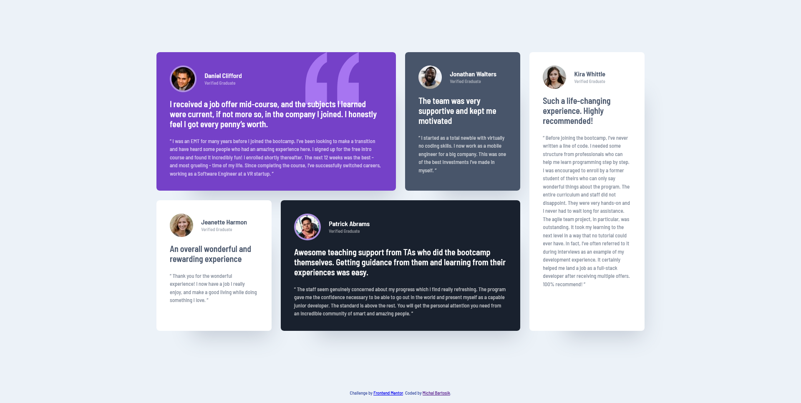

# Frontend Mentor - Testimonials grid section solution

This is a solution to the [Testimonials grid section challenge on Frontend Mentor](https://www.frontendmentor.io/challenges/testimonials-grid-section-Nnw6J7Un7). Frontend Mentor challenges help you improve your coding skills by building realistic projects.

You can see live preview [here](https://testimonials-grid-section-mbart13.vercel.app)

### Built with
- CSS Grid
- Sass
- Parcel

For this challenge I followed BEM naming convention and it's something I want to practice more.  
It was my first time using parcel bundler and I didn't have any serious issues with that.

